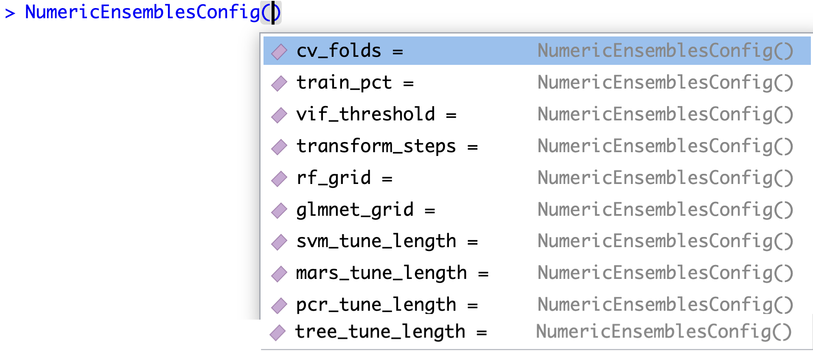
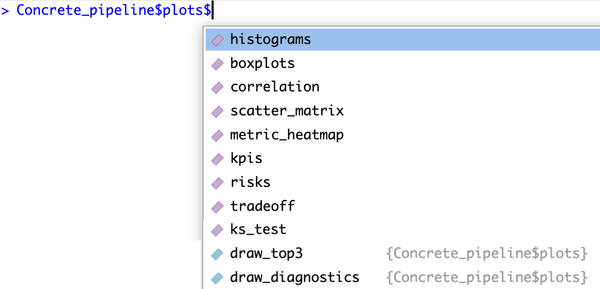
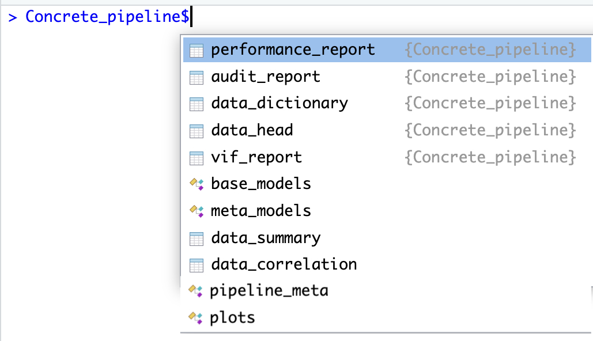

<!-- README.md is generated from README.Rmd. Please edit that file -->

```{r, include = FALSE}
knitr::opts_chunk$set(
  collapse = TRUE,
  comment = "#>",
  fig.path = "man/figures/README-",
  out.width = "100%"
)
```

# NumericEnsembles

The goal of NumericEnsembles is to automatically build ensembles of complete solutions where the target column is numeric.

## The story of NumericEnsembles

My name is Russ Conte, and I have worked for many years with multi-million dollar accounts for multi-billion dollar customers, main as a recruiter. One of the most common results I have seen are companies who do not use their data to get the best return for their investment to get the data. I had the insight about how to build ensembles of solutions on Saturday, October 22, 2022 at 4:58 pm. The original ensembles solution has been improved many times, and NumericEnsembles is one of ten ensembles solutions I have built that are currently available. The total list is:

1.  `NumericEnsembles`
2.  `ClassificationEnsembles`
3.  `LogisticEnsembles`
4.  `ForecastingEnsembles`
5.  `ClusteringEnsembles`
6.  `SurvivalEnsembles`
7.  `TextEnsembles`
8.  `CountingEnsembles`
9.  `SeverityEnsembles`
10. `MultiLabelEnsembles`

## Installation

You can install the development version of NumericEnsembles from [GitHub](https://github.com/) with:

```{r Install NumericEnsembles}
# library(pak)
# pak::pkg_install("NumericEnsembles")
```

## Pipelines: The best way to get results from all the ensembles packages

All ten ensembles packages all work best if you start by building a pipeline first. A pipeline will combine all the results (tables, plots, etc.) in one file which you can print, plot, predict, export, save, and much more.

## Your first pipeline in NumericEnsembles

```{r, Your first pipeline in NumericEnsembles}
library(NumericEnsembles)
Concrete_pipeline <- Numeric(
  dataset = Concrete[1:1000, ],
  target_col = 'Strength',
  facet_col = "",
  color_col = "",
  stratify_col = "",
  palette_style = "standard",
  verbose = "FALSE"
)
```

## Print six summary tables from the pipeline

```{r, Print summary tables}
print(Concrete_pipeline)
```

The six summary tables:

1.  Baseline sample head (the first six rows of the data)
2.  Data dictionary
3.  Data summary (Min., 1st Qu., Media, Mean, 3rd Qu., Max.)
4.  Multicollineraity VIF Filters Report
5.  Leaderboard: Top 10 Architectures by Testing RMSE
6.  Residuals Diagnostics

## Generate 11 plots from the pipeline

```{r, Print plots from the pipeline, two ways to do it}
plot(Concrete_pipeline) # Return one plot at a time
Concrete_pipeline$plots # Return all plots at the same time
```

The 11 plots:

Histograms (Feature Distributions)

Box Plots (Feature Range Profiles)

Feature Correlation Heatmap

Scatter Analysis: Target Variable vs Each Feature (with trend line)

Comparative Performance Metric Heat map Matrix

Core Model Performance Metrics (with 95% Confidence Intervals) and KPIs

Overfitting ratio (closer to 1.00 is better)

Directional Model Bias (closer to 0.00 is better)

Bias-Variance Joint Mapping Space (bias is the x-axis, variance is the y-axis)

Kolomogorov-Smirnov Test p-values (tests how likely the model result is from the same distribution as the training data)

## Predicting on new data, maybe the most important part

```{r, Predict on new untrained data}
Pipeline_prediction <- predict(object = Concrete_pipeline, newdata = Concrete[1001:nrow(Concrete), ], model_name = "best")
Pipeline_prediction
```

## Professional features of NumericEnsembles

Configuration options:





All the full reports from the pipeline:


