# NumericEnsembles

The goal of NumericEnsembles is to automatically build highly optimized
ensembles of complete solutions where the target column is continuous
numeric.

## The story of NumericEnsembles

My name is Russ Conte, and I have worked for many years with
multi-million dollar accounts for multi-billion dollar customers, mainly
as a recruiter. One of the most common results I have seen are companies
who do not use their data to get the best return for their investment to
get the data. I had the insight about how to build ensembles of
solutions on Saturday, October 22, 2022 at 4:58 pm. The original
ensembles solution has been improved many times, and NumericEnsembles is
one of 16 ensembles solutions I am building. The total list is:

1.  `NumericEnsembles`

2.  `ClassificationEnsembles`

3.  `LogisticEnsembles`

4.  `ForecastingEnsembles`

5.  `ClusteringEnsembles`

6.  `SurvivalEnsembles`

7.  `TextEnsembles`

8.  `CountingEnsembles`

9.  `SeverityEnsembles`

10. `MultiLabelEnsembles`

11. `NetworkEnsembles`

12. `SpatialEnsembles`

13. `SurveyEnsembles`

14. `LongitudinalEnsembles`

15. `CrossSectionalEnsembles`

16. `CohortEnsembles`

## Installation

You can install the development version of NumericEnsembles
from [GitHub](https://github.com/) with:

``` r
# library(pak)
# pak::pkg_install("InfiniteCuriosity/NumericEnsembles")
```

## Pipelines: The best way to get results from all the ensembles packages

All 13 ensembles packages work best if you start by building a pipeline
first. A pipeline combines all the results (tables, plots, models, and
metadata) into one structured asset which you can print, plot, predict,
export, save, and much more.

## Track 1: The Express Track (Quick Start)

The Express Track allows you to test your installation instantly using
rapid cross-validation configurations and automated synthetic data
generations:

``` r
library(NumericEnsembles)

# Using internal demo data generator as an express validation run
Concrete_express_pipeline <- NumericEnsemblesDemo()
#> Initializing NumericEnsembles Comprehensive Validation Demo...
#> --- Comprehensive Machine Learning Pipeline ---
#> 
#> [Extracting Baseline Profiles]: Capturing Head, Summary, and Correlation matrices...
#> 
#> [EDA Engine]: Generating data distribution, correlation, and scatter plots...
#> 
#> [VIF Check]: Evaluating attributes for multicollinearity using car::vif...
#> 
#> [Modeling Phase]: Launching 17 competitive base architectures concurrently...
#> Number of parameters (weights and biases) to estimate: 12 
#> Nguyen-Widrow method
#> Scaling factor= 0.7050777 
#> gamma= 5.9419     alpha= 1.1572   beta= 38.7273
#> Loading required package: earth
#> Loading required package: Formula
#> Loading required package: plotmo
#> Loading required package: plotrix
#> note: only 1 unique complexity parameters in default grid. Truncating the grid to 1 .
#> 
#> note: only 1 unique complexity parameters in default grid. Truncating the grid to 1 .
#> 
#> 
#> [Meta-Learner Engine]: Training 6 Advanced Stacking Meta-Learners (GLM, Enet, GAM, PLS, RF, SVM)...
#> Loading required package: gam
#> Loading required package: splines
#> Loading required package: foreach
#> Loaded gam 1.22-7
#>   |                                                                              |                                                                      |   0%  |                                                                              |=                                                                     |   1%  |                                                                              |==                                                                    |   2%  |                                                                              |==                                                                    |   3%  |                                                                              |===                                                                   |   4%  |                                                                              |====                                                                  |   5%  |                                                                              |====                                                                  |   6%  |                                                                              |=====                                                                 |   7%  |                                                                              |======                                                                |   8%  |                                                                              |======                                                                |   9%  |                                                                              |=======                                                               |  10%  |                                                                              |========                                                              |  11%  |                                                                              |========                                                              |  12%  |                                                                              |=========                                                             |  12%  |                                                                              |=========                                                             |  13%  |                                                                              |==========                                                            |  14%  |                                                                              |==========                                                            |  15%  |                                                                              |===========                                                           |  15%  |                                                                              |===========                                                           |  16%  |                                                                              |============                                                          |  17%  |                                                                              |============                                                          |  18%  |                                                                              |=============                                                         |  18%  |                                                                              |=============                                                         |  19%  |                                                                              |==============                                                        |  20%  |                                                                              |==============                                                        |  21%  |                                                                              |===============                                                       |  21%  |                                                                              |===============                                                       |  22%  |                                                                              |================                                                      |  23%  |                                                                              |================                                                      |  24%  |                                                                              |=================                                                     |  24%  |                                                                              |==================                                                    |  25%  |                                                                              |==================                                                    |  26%  |                                                                              |===================                                                   |  26%  |                                                                              |===================                                                   |  27%  |                                                                              |====================                                                  |  28%  |                                                                              |====================                                                  |  29%  |                                                                              |=====================                                                 |  29%  |                                                                              |=====================                                                 |  30%  |                                                                              |======================                                                |  31%  |                                                                              |======================                                                |  32%  |                                                                              |=======================                                               |  32%  |                                                                              |=======================                                               |  33%  |                                                                              |========================                                              |  34%  |                                                                              |========================                                              |  35%  |                                                                              |=========================                                             |  35%  |                                                                              |=========================                                             |  36%  |                                                                              |==========================                                            |  37%  |                                                                              |==========================                                            |  38%  |                                                                              |===========================                                           |  38%  |                                                                              |===========================                                           |  39%  |                                                                              |============================                                          |  40%  |                                                                              |=============================                                         |  41%  |                                                                              |=============================                                         |  42%  |                                                                              |==============================                                        |  43%  |                                                                              |===============================                                       |  44%  |                                                                              |===============================                                       |  45%  |                                                                              |================================                                      |  46%  |                                                                              |=================================                                     |  47%  |                                                                              |=================================                                     |  48%  |                                                                              |==================================                                    |  49%  |                                                                              |===================================                                   |  50%  |                                                                              |====================================                                  |  51%  |                                                                              |=====================================                                 |  52%  |                                                                              |=====================================                                 |  53%  |                                                                              |======================================                                |  54%  |                                                                              |=======================================                               |  55%  |                                                                              |=======================================                               |  56%  |                                                                              |========================================                              |  57%  |                                                                              |=========================================                             |  58%  |                                                                              |=========================================                             |  59%  |                                                                              |==========================================                            |  60%  |                                                                              |===========================================                           |  61%  |                                                                              |===========================================                           |  62%  |                                                                              |============================================                          |  62%  |                                                                              |============================================                          |  63%  |                                                                              |=============================================                         |  64%  |                                                                              |=============================================                         |  65%  |                                                                              |==============================================                        |  65%  |                                                                              |==============================================                        |  66%  |                                                                              |===============================================                       |  67%  |                                                                              |===============================================                       |  68%  |                                                                              |================================================                      |  68%  |                                                                              |================================================                      |  69%  |                                                                              |=================================================                     |  70%  |                                                                              |=================================================                     |  71%  |                                                                              |==================================================                    |  71%  |                                                                              |==================================================                    |  72%  |                                                                              |===================================================                   |  73%  |                                                                              |===================================================                   |  74%  |                                                                              |====================================================                  |  74%  |                                                                              |====================================================                  |  75%  |                                                                              |=====================================================                 |  76%  |                                                                              |======================================================                |  76%  |                                                                              |======================================================                |  77%  |                                                                              |=======================================================               |  78%  |                                                                              |=======================================================               |  79%  |                                                                              |========================================================              |  79%  |                                                                              |========================================================              |  80%  |                                                                              |=========================================================             |  81%  |                                                                              |=========================================================             |  82%  |                                                                              |==========================================================            |  82%  |                                                                              |==========================================================            |  83%  |                                                                              |===========================================================           |  84%  |                                                                              |===========================================================           |  85%  |                                                                              |============================================================          |  85%  |                                                                              |============================================================          |  86%  |                                                                              |=============================================================         |  87%  |                                                                              |=============================================================         |  88%  |                                                                              |==============================================================        |  88%  |                                                                              |==============================================================        |  89%  |                                                                              |===============================================================       |  90%  |                                                                              |================================================================      |  91%  |                                                                              |================================================================      |  92%  |                                                                              |=================================================================     |  93%  |                                                                              |==================================================================    |  94%  |                                                                              |==================================================================    |  95%  |                                                                              |===================================================================   |  96%  |                                                                              |====================================================================  |  97%  |                                                                              |====================================================================  |  98%  |                                                                              |===================================================================== |  99%  |                                                                              |======================================================================| 100%
#> 
#> =========================================================================
#>                   NUMERIC PIPELINE PIPELINE PROFILE EXPORTS             
#> =========================================================================
#> 
#> [1. BASELINE DATA SAMPLE HEAD]
#>   GDP_Growth Housing_Index Unemployment
#> 1  12.459262      257.9835   0.04228547
#> 2   9.955127      190.2356   0.04594228
#> 3  10.826804      222.7095   0.07676044
#> 4  11.816892      232.1502   0.10300087
#> 5  12.344511      224.1494   0.04038258
#> 6  11.923865      206.2856   0.11040796
#> 
#> [2. STRUCTURAL DATA DICTIONARY]
#>   Feature       Type    Missing_Count Missing_Pct Unique_Values
#> 1 GDP_Growth    numeric 0             0%          250          
#> 2 Housing_Index numeric 0             0%          250          
#> 3 Unemployment  numeric 0             0%          250          
#> 
#> [3. PIPELINE AUTOMATED EXPLORATORY SUMMARY INSIGHTS]
#>   Feature_Name  Data_Type          Missing_Rate Skewness_Coef Outliers_Found
#> 1 GDP_Growth    Numeric Continuous 0%           -0.12         1             
#> 2 Housing_Index Numeric Continuous 0%           -0.04         3             
#> 3 Unemployment  Numeric Continuous 0%            0.03         0             
#>   Operational_Insight          
#> 1 Structural Signature: Healthy
#> 2 Structural Signature: Healthy
#> 3 Structural Signature: Healthy
#> 
#> [4. STATISTICAL POPULATION DESCRIPTIVE SUMMARY]
#>    GDP_Growth     Housing_Index    Unemployment    
#>  Min.   : 5.898   Min.   :105.2   Min.   :0.03004  
#>  1st Qu.: 9.703   1st Qu.:187.4   1st Qu.:0.05398  
#>  Median :10.839   Median :208.8   Median :0.07491  
#>  Mean   :10.844   Mean   :209.3   Mean   :0.07546  
#>  3rd Qu.:11.901   3rd Qu.:232.2   3rd Qu.:0.09810  
#>  Max.   :14.630   Max.   :304.6   Max.   :0.11964  
#> 
#> [5. MULTICOLLINEARITY VIF FILTERS REPORT]
#>        Feature  VIF Status
#>  Housing_Index 1.04   Kept
#>   Unemployment 1.04   Kept
#> 
#> =========================================================================
#>                      LEADERBOARD & PREDICTIVE KPIS                       
#> =========================================================================
#> Total Models Analyzed: 33
#> Sampling Protocol: Standard Population Split
#> 
#> Top 10 Architectures By Testing RMSE:
#>              Model Testing_RMSE Testing_MAE Adjusted_R2 Variance KS_p_value
#>             Linear       0.5319      0.4242      0.8581   1.7708     0.3777
#>  Linear+ElasticNet       0.5334      0.4260      0.8573   1.7520     0.3777
#>       Linear+Lasso       0.5334      0.4260      0.8573   1.7520     0.3777
#>      Linear+Cubist       0.5335      0.4258      0.8572   1.7642     0.3777
#>         ElasticNet       0.5351      0.4278      0.8564   1.7334     0.3777
#>              Lasso       0.5351      0.4278      0.8564   1.7334     0.3777
#>   ElasticNet+Lasso       0.5351      0.4278      0.8564   1.7334     0.3777
#>             Cubist       0.5352      0.4275      0.8563   1.7577     0.3777
#>  Cubist+ElasticNet       0.5352      0.4277      0.8563   1.7455     0.3777
#>       Cubist+Lasso       0.5352      0.4277      0.8563   1.7455     0.3777
#>  Overfitting    Bias Duration
#>       1.0706 -0.0212    1.485
#>       1.0735 -0.0216    1.572
#>       1.0735 -0.0216    1.553
#>       1.0737 -0.0238    1.616
#>       1.0765 -0.0221    0.087
#>       1.0765 -0.0221    0.068
#>       1.0765 -0.0221    0.155
#>       1.0769 -0.0265    0.131
#>       1.0767 -0.0243    0.218
#>       1.0767 -0.0243    0.199
#> 
#> =========================================================================
#>                AUTOMATED RESIDUAL DIAGNOSTIC LEADERBOARD                 
#> =========================================================================
#>              Model Residual_Normality Variance_Stability Error_Independence
#>             Linear             Normal      Homoscedastic        Independent
#>  Linear+ElasticNet             Normal      Homoscedastic        Independent
#>       Linear+Lasso             Normal      Homoscedastic        Independent
#>      Linear+Cubist             Normal      Homoscedastic        Independent
#>         ElasticNet             Normal      Homoscedastic        Independent
#>              Lasso             Normal      Homoscedastic        Independent
#>   ElasticNet+Lasso             Normal      Homoscedastic        Independent
#>             Cubist             Normal      Homoscedastic        Independent
#>  Cubist+ElasticNet             Normal      Homoscedastic        Independent
#>       Cubist+Lasso             Normal      Homoscedastic        Independent
```

## Track 2: The Fast (but not as fast as Express) track

This example features facet colors, column colors and stratify colors.
You can use these features in many other data sets.

``` r
library(NumericEnsembles)
Insurance <- NumericEnsembles::Insurance[1:100, ]
Insurance_pipeline <- Numeric(dataset = Insurance, target_col = 'charges', facet_col = 'sex', color_col = 'smoker', stratify_col = 'region', palette_style = "modern", config = NumericEnsemblesFastConfig(), verbose = TRUE)
#> --- Comprehensive Machine Learning Pipeline ---
#> 
#> [Extracting Baseline Profiles]: Capturing Head, Summary, and Correlation matrices...
#> 
#> [EDA Engine]: Generating data distribution, correlation, and scatter plots...
#> 
#> [VIF Check]: Evaluating attributes for multicollinearity using car::vif...
#> 
#> [Modeling Phase]: Launching 17 competitive base architectures concurrently...
#> Number of parameters (weights and biases) to estimate: 30 
#> Nguyen-Widrow method
#> Scaling factor= 0.7127212 
#> gamma= 23.1   alpha= 2.5274   beta= 20.8045 
#> 
#> [Meta-Learner Engine]: Training 6 Advanced Stacking Meta-Learners (GLM, Enet, GAM, PLS, RF, SVM)...
#>   |                                                                              |                                                                      |   0%  |                                                                              |=                                                                     |   1%  |                                                                              |==                                                                    |   2%  |                                                                              |==                                                                    |   3%  |                                                                              |===                                                                   |   4%  |                                                                              |====                                                                  |   5%  |                                                                              |====                                                                  |   6%  |                                                                              |=====                                                                 |   7%  |                                                                              |======                                                                |   8%  |                                                                              |======                                                                |   9%  |                                                                              |=======                                                               |  10%  |                                                                              |========                                                              |  11%  |                                                                              |========                                                              |  12%  |                                                                              |=========                                                             |  12%  |                                                                              |=========                                                             |  13%  |                                                                              |==========                                                            |  14%  |                                                                              |==========                                                            |  15%  |                                                                              |===========                                                           |  15%  |                                                                              |===========                                                           |  16%  |                                                                              |============                                                          |  17%  |                                                                              |============                                                          |  18%  |                                                                              |=============                                                         |  18%  |                                                                              |=============                                                         |  19%  |                                                                              |==============                                                        |  20%  |                                                                              |==============                                                        |  21%  |                                                                              |===============                                                       |  21%  |                                                                              |===============                                                       |  22%  |                                                                              |================                                                      |  23%  |                                                                              |================                                                      |  24%  |                                                                              |=================                                                     |  24%  |                                                                              |==================                                                    |  25%  |                                                                              |==================                                                    |  26%  |                                                                              |===================                                                   |  26%  |                                                                              |===================                                                   |  27%  |                                                                              |====================                                                  |  28%  |                                                                              |====================                                                  |  29%  |                                                                              |=====================                                                 |  29%  |                                                                              |=====================                                                 |  30%  |                                                                              |======================                                                |  31%  |                                                                              |======================                                                |  32%  |                                                                              |=======================                                               |  32%  |                                                                              |=======================                                               |  33%  |                                                                              |========================                                              |  34%  |                                                                              |========================                                              |  35%  |                                                                              |=========================                                             |  35%  |                                                                              |=========================                                             |  36%  |                                                                              |==========================                                            |  37%  |                                                                              |==========================                                            |  38%  |                                                                              |===========================                                           |  38%  |                                                                              |===========================                                           |  39%  |                                                                              |============================                                          |  40%  |                                                                              |=============================                                         |  41%  |                                                                              |=============================                                         |  42%  |                                                                              |==============================                                        |  43%  |                                                                              |===============================                                       |  44%  |                                                                              |===============================                                       |  45%  |                                                                              |================================                                      |  46%  |                                                                              |=================================                                     |  47%  |                                                                              |=================================                                     |  48%  |                                                                              |==================================                                    |  49%  |                                                                              |===================================                                   |  50%  |                                                                              |====================================                                  |  51%  |                                                                              |=====================================                                 |  52%  |                                                                              |=====================================                                 |  53%  |                                                                              |======================================                                |  54%  |                                                                              |=======================================                               |  55%  |                                                                              |=======================================                               |  56%  |                                                                              |========================================                              |  57%  |                                                                              |=========================================                             |  58%  |                                                                              |=========================================                             |  59%  |                                                                              |==========================================                            |  60%  |                                                                              |===========================================                           |  61%  |                                                                              |===========================================                           |  62%  |                                                                              |============================================                          |  62%  |                                                                              |============================================                          |  63%  |                                                                              |=============================================                         |  64%  |                                                                              |=============================================                         |  65%  |                                                                              |==============================================                        |  65%  |                                                                              |==============================================                        |  66%  |                                                                              |===============================================                       |  67%  |                                                                              |===============================================                       |  68%  |                                                                              |================================================                      |  68%  |                                                                              |================================================                      |  69%  |                                                                              |=================================================                     |  70%  |                                                                              |=================================================                     |  71%  |                                                                              |==================================================                    |  71%  |                                                                              |==================================================                    |  72%  |                                                                              |===================================================                   |  73%  |                                                                              |===================================================                   |  74%  |                                                                              |====================================================                  |  74%  |                                                                              |====================================================                  |  75%  |                                                                              |=====================================================                 |  76%  |                                                                              |======================================================                |  76%  |                                                                              |======================================================                |  77%  |                                                                              |=======================================================               |  78%  |                                                                              |=======================================================               |  79%  |                                                                              |========================================================              |  79%  |                                                                              |========================================================              |  80%  |                                                                              |=========================================================             |  81%  |                                                                              |=========================================================             |  82%  |                                                                              |==========================================================            |  82%  |                                                                              |==========================================================            |  83%  |                                                                              |===========================================================           |  84%  |                                                                              |===========================================================           |  85%  |                                                                              |============================================================          |  85%  |                                                                              |============================================================          |  86%  |                                                                              |=============================================================         |  87%  |                                                                              |=============================================================         |  88%  |                                                                              |==============================================================        |  88%  |                                                                              |==============================================================        |  89%  |                                                                              |===============================================================       |  90%  |                                                                              |================================================================      |  91%  |                                                                              |================================================================      |  92%  |                                                                              |=================================================================     |  93%  |                                                                              |==================================================================    |  94%  |                                                                              |==================================================================    |  95%  |                                                                              |===================================================================   |  96%  |                                                                              |====================================================================  |  97%  |                                                                              |====================================================================  |  98%  |                                                                              |===================================================================== |  99%  |                                                                              |======================================================================| 100%
print(Insurance_pipeline)
#> 
#> =========================================================================
#>                   NUMERIC PIPELINE PIPELINE PROFILE EXPORTS             
#> =========================================================================
#> 
#> [1. BASELINE DATA SAMPLE HEAD]
#>   age    sex    bmi children smoker    region   charges
#> 1  19 female 27.900        0    yes southwest 16884.924
#> 2  18   male 33.770        1     no southeast  1725.552
#> 3  28   male 33.000        3     no southeast  4449.462
#> 4  33   male 22.705        0     no northwest 21984.471
#> 5  32   male 28.880        0     no northwest  3866.855
#> 6  31 female 25.740        0     no southeast  3756.622
#> 
#> [2. STRUCTURAL DATA DICTIONARY]
#>   Feature  Type      Missing_Count Missing_Pct Unique_Values
#> 1 age      integer   0             0%           41          
#> 2 sex      character 0             0%            2          
#> 3 bmi      numeric   0             0%           93          
#> 4 children integer   0             0%            6          
#> 5 smoker   character 0             0%            2          
#> 6 region   character 0             0%            4          
#> 7 charges  numeric   0             0%          100          
#> 
#> [3. PIPELINE AUTOMATED EXPLORATORY SUMMARY INSIGHTS]
#>   Feature_Name Data_Type          Missing_Rate Skewness_Coef Outliers_Found
#> 1 age          Numeric Continuous 0%            0.20         0             
#> 2 sex          character          0%              NA         0             
#> 3 bmi          Numeric Continuous 0%           -0.12         0             
#> 4 children     Numeric Continuous 0%            1.06         0             
#> 5 smoker       character          0%              NA         0             
#> 6 region       character          0%              NA         0             
#> 7 charges      Numeric Continuous 0%            1.15         4             
#>   Operational_Insight                       
#> 1 Structural Signature: Healthy             
#> 2 Discrete Feature / Dummy Pipeline Required
#> 3 Structural Signature: Healthy             
#> 4 Structural Signature: Healthy             
#> 5 Discrete Feature / Dummy Pipeline Required
#> 6 Discrete Feature / Dummy Pipeline Required
#> 7 Structural Signature: Healthy             
#> 
#> [4. STATISTICAL POPULATION DESCRIPTIVE SUMMARY]
#>       age               sex           bmi           children          smoker   
#>  Min.   :18.00   Length   :100   Min.   :17.39   Min.   :0.00   Length   :100  
#>  1st Qu.:26.75   N.unique :  2   1st Qu.:26.53   1st Qu.:0.00   N.unique :  2  
#>  Median :37.00   N.blank  :  0   Median :30.98   Median :1.00   N.blank  :  0  
#>  Mean   :38.84   Min.nchar:  4   Mean   :30.85   Mean   :1.07   Min.nchar:  2  
#>  3rd Qu.:55.00   Max.nchar:  6   3rd Qu.:35.55   3rd Qu.:2.00   Max.nchar:  3  
#>  Max.   :64.00                   Max.   :42.13   Max.   :5.00                  
#>        region       charges     
#>  Length   :100   Min.   : 1137  
#>  N.unique :  4   1st Qu.: 4368  
#>  N.blank  :  0   Median :10700  
#>  Min.nchar:  9   Mean   :14588  
#>  Max.nchar:  9   3rd Qu.:20747  
#>                  Max.   :51195  
#> 
#> [5. MULTICOLLINEARITY VIF FILTERS REPORT]
#>          Feature  VIF Status
#>              age 1.12   Kept
#>          sexmale 1.11   Kept
#>              bmi 1.11   Kept
#>         children 1.11   Kept
#>        smokeryes 1.11   Kept
#>  regionnorthwest 1.78   Kept
#>  regionsoutheast 1.74   Kept
#>  regionsouthwest 1.71   Kept
#> 
#> =========================================================================
#>                      LEADERBOARD & PREDICTIVE KPIS                       
#> =========================================================================
#> Total Models Analyzed: 33
#> Sampling Protocol: Stratified Sampling based on column 'region'
#> 
#> Top 10 Architectures By Testing RMSE:
#>                   Model Testing_RMSE Testing_MAE Adjusted_R2  Variance
#>                  Cubist     3830.211    1617.970      0.9079 184736472
#>       Cubist+QuantileRF     3880.504    1731.593      0.9212 183208282
#>              QuantileRF     3986.518    1898.923      0.9002 182114770
#>               Meta_Enet     4053.167    2394.955      0.8526 144352331
#>                Meta_PLS     4097.671    2495.042      0.8494 151645008
#>                 Meta_RF     4138.611    2423.682      0.8463 147140706
#>     BayesRNN+QuantileRF     4144.248    2476.923      0.9101 167541748
#>         Cubist+BayesRNN     4179.025    2564.561      0.9086 169731508
#>      Cubist+Bagged_MARS     4398.077    2759.742      0.8988 151497298
#>  QuantileRF+Bagged_MARS     4439.854    2872.456      0.8968 149966829
#>  KS_p_value Overfitting       Bias Duration
#>      0.9256      1.2349  -980.3730    0.146
#>      0.9261      1.6550 -1086.8736    0.351
#>      0.9059      1.9278 -1193.3742    0.205
#>      0.8103      1.8826  -903.5311    0.199
#>      0.7314      2.3371 -1130.0778    0.070
#>      0.9357      3.1345  -903.5435    0.171
#>      0.9146      1.9479  -933.5961    0.301
#>      0.8602      1.4893  -827.0955    0.242
#>      0.8877      1.2155  -903.5828    0.540
#>      0.7393      1.4838 -1010.0833    0.599
#> 
#> =========================================================================
#>                AUTOMATED RESIDUAL DIAGNOSTIC LEADERBOARD                 
#> =========================================================================
#>                   Model             Residual_Normality
#>                  Cubist Non-Normal (Biased Tail Risks)
#>       Cubist+QuantileRF Non-Normal (Biased Tail Risks)
#>              QuantileRF Non-Normal (Biased Tail Risks)
#>               Meta_Enet Non-Normal (Biased Tail Risks)
#>                Meta_PLS Non-Normal (Biased Tail Risks)
#>                 Meta_RF Non-Normal (Biased Tail Risks)
#>     BayesRNN+QuantileRF Non-Normal (Biased Tail Risks)
#>         Cubist+BayesRNN Non-Normal (Biased Tail Risks)
#>      Cubist+Bagged_MARS Non-Normal (Biased Tail Risks)
#>  QuantileRF+Bagged_MARS Non-Normal (Biased Tail Risks)
#>                   Variance_Stability Error_Independence
#>                        Homoscedastic        Independent
#>                        Homoscedastic        Independent
#>  Heteroscedastic (Unstable Variance)        Independent
#>  Heteroscedastic (Unstable Variance)        Independent
#>  Heteroscedastic (Unstable Variance)        Independent
#>  Heteroscedastic (Unstable Variance)        Independent
#>                        Homoscedastic        Independent
#>                        Homoscedastic        Independent
#>  Heteroscedastic (Unstable Variance)        Independent
#>  Heteroscedastic (Unstable Variance)        Independent
#> 
#> [Audit Alert]: Heteroscedasticity caught in leader zone. Upper intervals could degrade.
#> [Audit Alert]: Non-normal residuals mapped in leader zone. Points possess fat tails.
Insurance_pipeline$plots # plots all in one command
#> $histograms
```

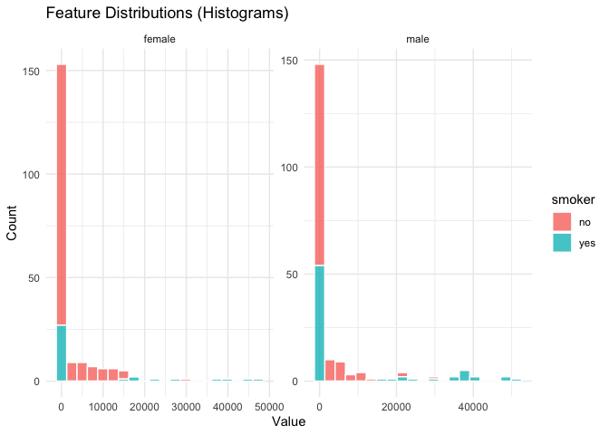

    #> 
    #> $boxplots

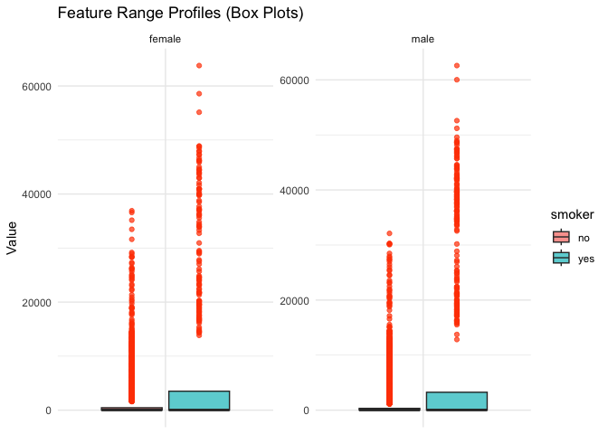

    #> 
    #> $correlation

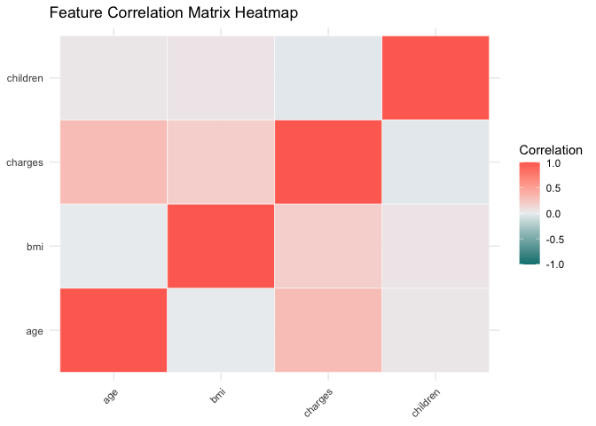

    #> 
    #> $scatter_matrix
    #> `geom_smooth()` using formula = 'y ~ x'

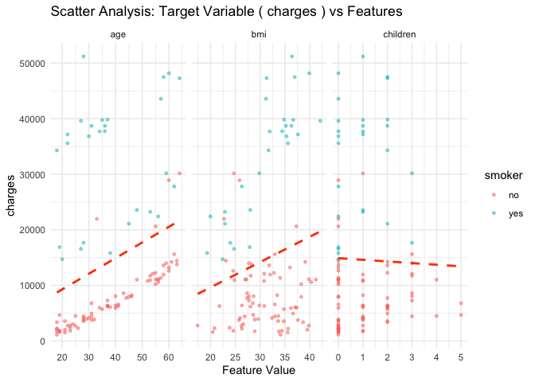

    #> 
    #> $metric_heatmap

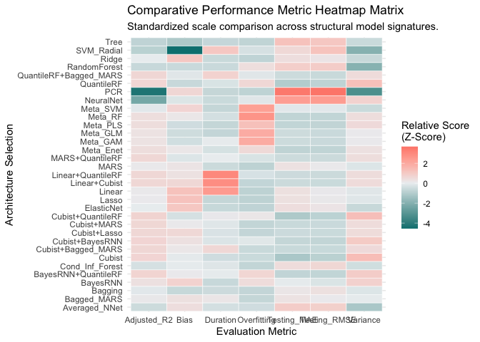

    #> 
    #> $kpis

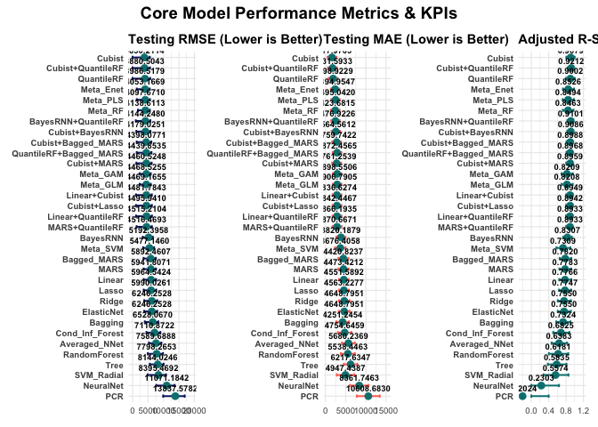

    #> 
    #> $risks

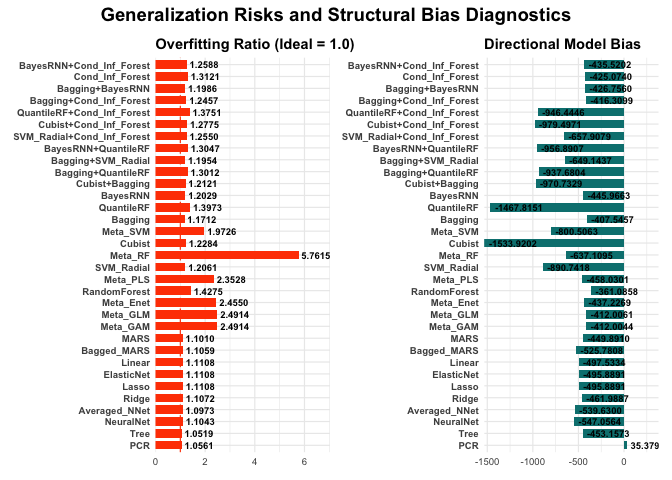

    #> 
    #> $tradeoff

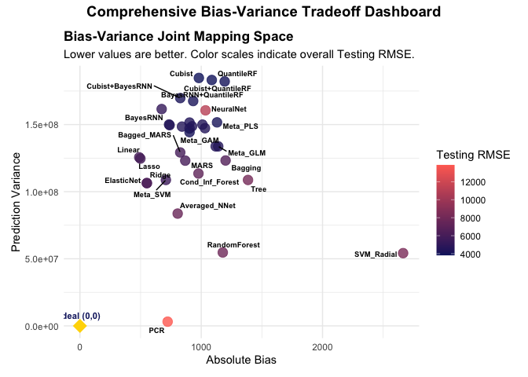

    #> 
    #> $ks_test

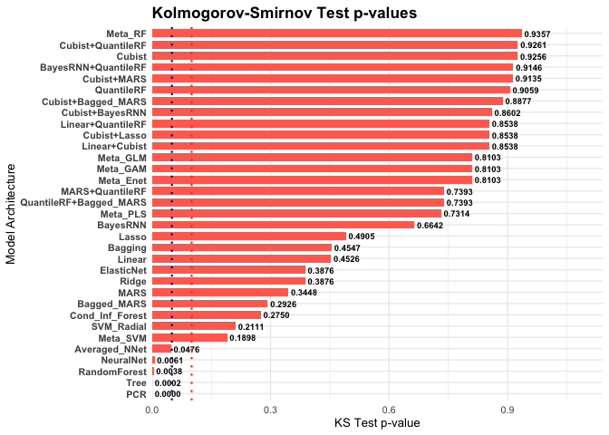

    #> 
    #> $cooks_distance

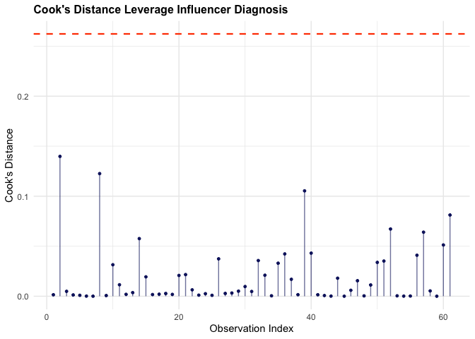

    #> 
    #> $draw_top3
    #> function () 
    #> {
    #>     .draw_top3_panel(top_3_models, pred_test_list, actual_test, 
    #>         models_list, train_data, target_col, theme_colors)
    #> }
    #> <bytecode: 0xc667124d8>
    #> <environment: 0xc563a1c78>
    #> 
    #> $draw_diagnostics
    #> function () 
    #> {
    #>     .draw_diagnostics_panel(top_3_models, pred_test_list, pred_train_list, 
    #>         actual_test, actual_train, test_data, target_col, theme_colors, 
    #>         top_pred_names)
    #> }
    #> <bytecode: 0xc66712ac0>
    #> <environment: 0xc563a1c78>

## Track 3: The Institutional Track (Professional Production, this example will have a lower root mean squared error than an article in Nature for the exact same data set)

For this next example we will be using the `Concrete` data set, and
achieving a lower root mean squared error (RMSE) than this article in
Nature on the same data set:
<https://www.nature.com/articles/s41598-024-69616-9>. The article shows
a lowest RMSE of 5.11, NumericEnsembles will get a best RMSE that is
lower than 5.11, and you will be able to verify the result.

For enterprise-grade model deployments, you can decouple hyperparameter
states from your execution tracks using the
complete `NumericEnsemblesConfig()` matrix. This path showcases advanced
feature transformations (including `YeoJohnson`power-scaling),
high-leverage data outlier filtering via Cook’s Distance, and rigorous
multi-model hyperparameter tuning grids:

``` r
library(NumericEnsembles)

# 1. Establish custom, comprehensive hyperparameter tuning grids
custom_glmnet_grid <- expand.grid(
  alpha  = seq(0, 1, length = 5),
  lambda = seq(0.001, 0.2, length = 10)
)

custom_rf_grid <- expand.grid(
  mtry = c(2, 4, 6, 8)
)

# 2. Build the fine-grained execution configuration matrix
institutional_config <- NumericEnsemblesConfig(
  cv_folds        = 10,       # Rigid 10-fold cross-validation
  train_pct       = 0.80,     # 80/20 train-test population split
  vif_threshold   = 10.0,     # Strict multicollinearity screening
  cooks_threshold = 2.0,      # Prune high-leverage outliers over 2 * (4/n)
  transform_steps = c("nzv", "medianImpute", "center", "scale", "YeoJohnson"),
  glmnet_grid     = custom_glmnet_grid,
  rf_grid         = custom_rf_grid,
  svm_tune_length = 10,
  pcr_tune_length = 10
)

# 3. Execute the concurrent machine learning rival engine
Concrete_pipeline <- Numeric(
  dataset       = Concrete[1:100, ], 
  target_col    = 'Strength', 
  palette_style = "modern", 
  config        = institutional_config, 
  verbose       = TRUE
)
#> --- Comprehensive Machine Learning Pipeline ---
#> 
#> [Extracting Baseline Profiles]: Capturing Head, Summary, and Correlation matrices...
#> 
#> [EDA Engine]: Generating data distribution, correlation, and scatter plots...
#> 
#> [Leverage Engine]: Pruning 5 structural outliers via Cook's Distance cutoff (0.10000)...
#> 
#> [VIF Check]: Evaluating attributes for multicollinearity using car::vif...
#> 
#> [Modeling Phase]: Launching 17 competitive base architectures concurrently...
#> Number of parameters (weights and biases) to estimate: 27 
#> Nguyen-Widrow method
#> Scaling factor= 0.7103292 
#> gamma= 24.8518    alpha= 0.0991   beta= 83.4948 
#> 
#> [Meta-Learner Engine]: Training 6 Advanced Stacking Meta-Learners (GLM, Enet, GAM, PLS, RF, SVM)...
#>   |                                                                              |                                                                      |   0%  |                                                                              |=                                                                     |   1%  |                                                                              |==                                                                    |   2%  |                                                                              |==                                                                    |   3%  |                                                                              |===                                                                   |   4%  |                                                                              |====                                                                  |   5%  |                                                                              |====                                                                  |   6%  |                                                                              |=====                                                                 |   7%  |                                                                              |======                                                                |   8%  |                                                                              |======                                                                |   9%  |                                                                              |=======                                                               |  10%  |                                                                              |========                                                              |  11%  |                                                                              |========                                                              |  12%  |                                                                              |=========                                                             |  12%  |                                                                              |=========                                                             |  13%  |                                                                              |==========                                                            |  14%  |                                                                              |==========                                                            |  15%  |                                                                              |===========                                                           |  15%  |                                                                              |===========                                                           |  16%  |                                                                              |============                                                          |  17%  |                                                                              |============                                                          |  18%  |                                                                              |=============                                                         |  18%  |                                                                              |=============                                                         |  19%  |                                                                              |==============                                                        |  20%  |                                                                              |==============                                                        |  21%  |                                                                              |===============                                                       |  21%  |                                                                              |===============                                                       |  22%  |                                                                              |================                                                      |  23%  |                                                                              |================                                                      |  24%  |                                                                              |=================                                                     |  24%  |                                                                              |==================                                                    |  25%  |                                                                              |==================                                                    |  26%  |                                                                              |===================                                                   |  26%  |                                                                              |===================                                                   |  27%  |                                                                              |====================                                                  |  28%  |                                                                              |====================                                                  |  29%  |                                                                              |=====================                                                 |  29%  |                                                                              |=====================                                                 |  30%  |                                                                              |======================                                                |  31%  |                                                                              |======================                                                |  32%  |                                                                              |=======================                                               |  32%  |                                                                              |=======================                                               |  33%  |                                                                              |========================                                              |  34%  |                                                                              |========================                                              |  35%  |                                                                              |=========================                                             |  35%  |                                                                              |=========================                                             |  36%  |                                                                              |==========================                                            |  37%  |                                                                              |==========================                                            |  38%  |                                                                              |===========================                                           |  38%  |                                                                              |===========================                                           |  39%  |                                                                              |============================                                          |  40%  |                                                                              |=============================                                         |  41%  |                                                                              |=============================                                         |  42%  |                                                                              |==============================                                        |  43%  |                                                                              |===============================                                       |  44%  |                                                                              |===============================                                       |  45%  |                                                                              |================================                                      |  46%  |                                                                              |=================================                                     |  47%  |                                                                              |=================================                                     |  48%  |                                                                              |==================================                                    |  49%  |                                                                              |===================================                                   |  50%  |                                                                              |====================================                                  |  51%  |                                                                              |=====================================                                 |  52%  |                                                                              |=====================================                                 |  53%  |                                                                              |======================================                                |  54%  |                                                                              |=======================================                               |  55%  |                                                                              |=======================================                               |  56%  |                                                                              |========================================                              |  57%  |                                                                              |=========================================                             |  58%  |                                                                              |=========================================                             |  59%  |                                                                              |==========================================                            |  60%  |                                                                              |===========================================                           |  61%  |                                                                              |===========================================                           |  62%  |                                                                              |============================================                          |  62%  |                                                                              |============================================                          |  63%  |                                                                              |=============================================                         |  64%  |                                                                              |=============================================                         |  65%  |                                                                              |==============================================                        |  65%  |                                                                              |==============================================                        |  66%  |                                                                              |===============================================                       |  67%  |                                                                              |===============================================                       |  68%  |                                                                              |================================================                      |  68%  |                                                                              |================================================                      |  69%  |                                                                              |=================================================                     |  70%  |                                                                              |=================================================                     |  71%  |                                                                              |==================================================                    |  71%  |                                                                              |==================================================                    |  72%  |                                                                              |===================================================                   |  73%  |                                                                              |===================================================                   |  74%  |                                                                              |====================================================                  |  74%  |                                                                              |====================================================                  |  75%  |                                                                              |=====================================================                 |  76%  |                                                                              |======================================================                |  76%  |                                                                              |======================================================                |  77%  |                                                                              |=======================================================               |  78%  |                                                                              |=======================================================               |  79%  |                                                                              |========================================================              |  79%  |                                                                              |========================================================              |  80%  |                                                                              |=========================================================             |  81%  |                                                                              |=========================================================             |  82%  |                                                                              |==========================================================            |  82%  |                                                                              |==========================================================            |  83%  |                                                                              |===========================================================           |  84%  |                                                                              |===========================================================           |  85%  |                                                                              |============================================================          |  85%  |                                                                              |============================================================          |  86%  |                                                                              |=============================================================         |  87%  |                                                                              |=============================================================         |  88%  |                                                                              |==============================================================        |  88%  |                                                                              |==============================================================        |  89%  |                                                                              |===============================================================       |  90%  |                                                                              |================================================================      |  91%  |                                                                              |================================================================      |  92%  |                                                                              |=================================================================     |  93%  |                                                                              |==================================================================    |  94%  |                                                                              |==================================================================    |  95%  |                                                                              |===================================================================   |  96%  |                                                                              |====================================================================  |  97%  |                                                                              |====================================================================  |  98%  |                                                                              |===================================================================== |  99%  |                                                                              |======================================================================| 100%

# 4 Verify five best results
Concrete_pipeline$performance_report[1:5, ]
#>                Model Testing_RMSE RMSE 95% CI Lower RMSE 95% CI Upper
#> 1               MARS       4.8621                 0            7.5851
#> 2   MARS+Bagged_MARS       5.3312                 0            8.2688
#> 3        Cubist+MARS       5.3869                 0            8.7566
#> 4 Cubist+Bagged_MARS       6.0587                 0            9.5680
#> 5        Bagged_MARS       6.0823                 0            9.1439
#>   Testing_MAE MAE 95% CI Lower MAE 95% CI Upper Adjusted_R2
#> 1      2.7305           0.9215           4.5394      0.7264
#> 2      3.0929           1.1404           5.0454      0.7871
#> 3      2.6236           0.5080           4.7392      0.7827
#> 4      3.1201           0.7849           5.4554      0.7251
#> 5      3.7004           1.5298           5.8710      0.5718
#>   Adjusted R2 95% CI Lower Adjusted R2 95% CI Upper Duration Overfitting
#> 1                   0.3674                        1    0.180      1.1184
#> 2                   0.5135                        1    1.853      1.5195
#> 3                   0.4544                        1    0.618      2.1965
#> 4                   0.3487                        1    2.111      3.1049
#> 5                   0.0806                        1    1.673      1.9645
#>      Bias Variance KS_p_value
#> 1 -1.1402  97.8231     0.9910
#> 2 -1.4963  94.9299     0.7468
#> 3 -1.7481  94.1771     0.4838
#> 4 -2.1042  93.8884     0.4880
#> 5 -1.8524  95.7606     0.4847
```

## Print the Summary Profiles from any NumericEnsembles Pipeline

When you call `print()` on your pipeline object, it outputs a
multi-profile metadata evaluation series:

1.  **Baseline Sample Head & Population Description:** Immediate
    tracking of your baseline raw data structures.

2.  **Structural Data Dictionary:** Maps column classes, missing value
    counts, and unique value frequencies.

3.  **Automated Exploratory Summary Insights:** Granular tracking of
    feature anomalies, calculating exact skewness coefficients, IQR
    outlier counts, and emitting specific operational text insights.

4.  **Multicollinearity Threshold Audit Report:** A complete breakdown
    of columns evaluated, empirical Variance Inflation Factors (VIF),
    and selection status (“Kept” vs “Dropped”).

5.  **Ensemble Performance Leaderboard Evaluation:** Multi-engine
    rankings sorted by Testing RMSE, complete with MAE, Adjusted R2,
    prediction variance, and run durations.

6.  **Automated Residual Diagnostic Leaderboard:** Runs validation scans
    checking residuals for normality (Shapiro-Wilk), homoscedasticity
    (Spearman), and error independence (Durbin-Watson).

## Generate Diagnostic Plots from any NumericEnsembles Pipeline

You can interact with your visual diagnostics package in two standard
ways:

``` r
# plot(Concrete_pipeline)  # Sequentially render plots to your active device window
Concrete_pipeline$plots  # Direct programmatic access to specific ggplot2 objects
#> $histograms
```

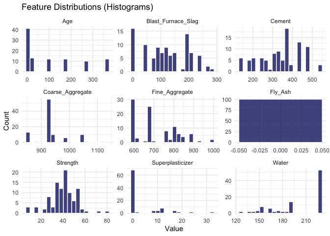

    #> 
    #> $boxplots

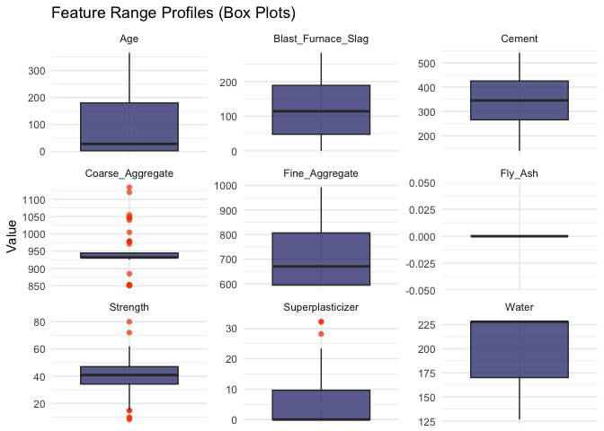

    #> 
    #> $correlation

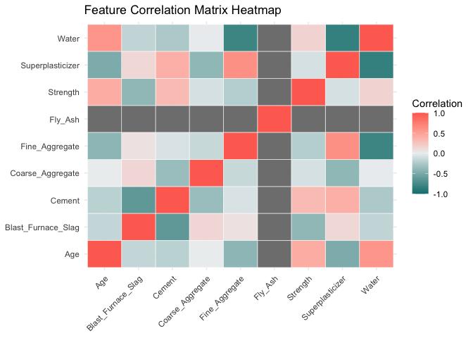

    #> 
    #> $scatter_matrix
    #> `geom_smooth()` using formula = 'y ~ x'

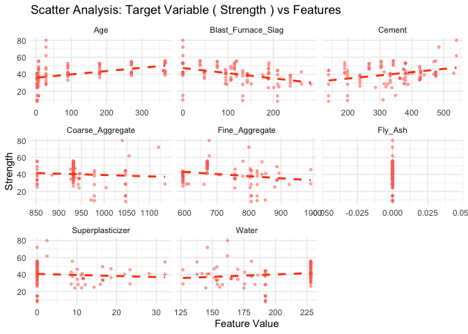

    #> 
    #> $metric_heatmap

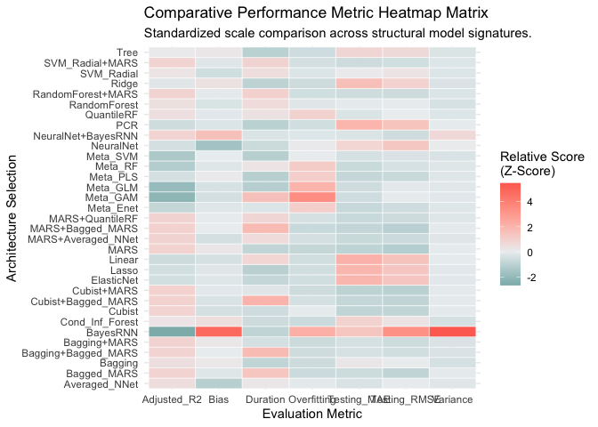

    #> 
    #> $kpis

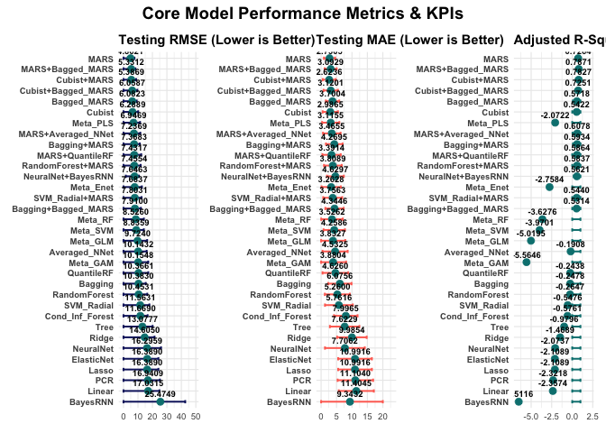

    #> 
    #> $risks

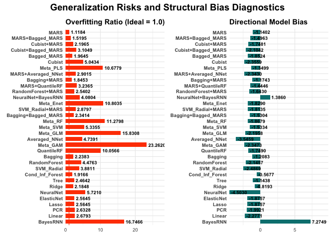

    #> 
    #> $tradeoff

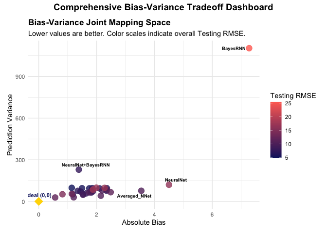

    #> 
    #> $ks_test

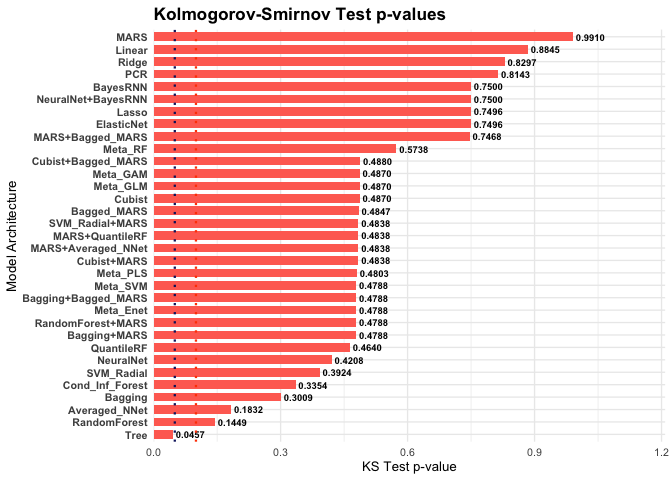

    #> 
    #> $cooks_distance

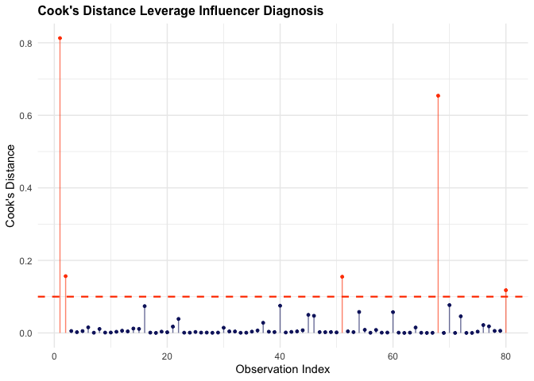

    #> 
    #> $draw_top3
    #> function () 
    #> {
    #>     .draw_top3_panel(top_3_models, pred_test_list, actual_test, 
    #>         models_list, train_data, target_col, theme_colors)
    #> }
    #> <bytecode: 0xc667124d8>
    #> <environment: 0xc566a7000>
    #> 
    #> $draw_diagnostics
    #> function () 
    #> {
    #>     .draw_diagnostics_panel(top_3_models, pred_test_list, pred_train_list, 
    #>         actual_test, actual_train, test_data, target_col, theme_colors, 
    #>         top_pred_names)
    #> }
    #> <bytecode: 0xc66712ac0>
    #> <environment: 0xc566a7000>

The professional visual diagnostics portfolio includes:

- **Histograms:** Continuous feature density and population distribution
  panels.

- **Box Plots:** Predictor range distribution quantiles and scale
  profiles.

- **Correlation Heatmap:** Multi-feature linear explanatory predictor
  correlation matrices.

- **Scatter Analysis Matrix:** Individual regression line mappings
  matching the target column against features.

- **Performance Metrics & KPIs:** Horizontal ranking of cross-validated
  architectures showcasing explicit **95% predictive confidence
  intervals** across RMSE, MAE, and Adjusted R2.

- **Generalization Risks & Structural Bias:** Mappings tracking
  overfitting ratios and model directionality bias.

- **Bias-Variance Space:** Joint coordinate mapping of directional model
  bias vs empirical variance relative to an absolute ideal vector
  origin.

- **Kolmogorov-Smirnov Test Mappings:** Charting distribution alignment
  p-values across your candidate algorithms.

- **Cook’s Distance Leverage Timeline:** A standalone segment tracker
  charting raw outlier boundaries.

## Predicting on New Data

Programmatic predictions can be generated instantly using the pipeline’s
optimized S3 method wrapper, utilizing the absolute top-performing
champion model architecture:

``` r
prospective_data <- Concrete[1001:1030, ]
Pipeline_predictions <- predict(object = Concrete_pipeline, newdata = prospective_data, model_name = "best")
```

For industrial workloads, use `predict_production()` to automatically
obtain point projections alongside matching row-level 95% upper and
lower assurance boundaries for the top 3 champion models:

``` r
Production_report <- predict_production(object = Concrete_pipeline, newdata = prospective_data)
Production_report
#>    Row_Index Rank_1_MARS_Prediction Rank_1_MARS_95_LowerBound
#> 1          1                  26.20                     16.69
#> 2          2                  42.02                     32.51
#> 3          3                  48.30                     38.79
#> 4          4                  52.68                     43.17
#> 5          5                  42.85                     33.34
#> 6          6                  36.98                     27.47
#> 7          7                  23.52                     14.01
#> 8          8                  33.03                     23.53
#> 9          9                  30.10                     20.60
#> 10        10                  41.12                     31.62
#> 11        11                  42.41                     32.91
#> 12        12                  43.27                     33.77
#> 13        13                  48.72                     39.21
#> 14        14                  44.89                     35.38
#> 15        15                  27.39                     17.89
#> 16        16                  47.37                     37.87
#> 17        17                  23.46                     13.96
#> 18        18                  42.14                     32.64
#> 19        19                  42.64                     33.13
#> 20        20                  22.77                     13.27
#> 21        21                  43.38                     33.87
#> 22        22                  41.13                     31.62
#> 23        23                  39.58                     30.08
#> 24        24                  34.03                     24.53
#> 25        25                  35.51                     26.01
#> 26        26                  41.55                     32.05
#> 27        27                  42.69                     33.19
#> 28        28                  25.36                     15.86
#> 29        29                  29.87                     20.36
#> 30        30                  38.41                     28.91
#>    Rank_1_MARS_95_UpperBound Rank_2_MARS_and_Bagged_MARS_Prediction
#> 1                      35.70                                  34.67
#> 2                      51.52                                  45.94
#> 3                      57.80                                  45.32
#> 4                      62.18                                  49.69
#> 5                      52.35                                  44.29
#> 6                      46.48                                  37.39
#> 7                      33.02                                  32.52
#> 8                      42.54                                  39.72
#> 9                      39.61                                  37.97
#> 10                     50.62                                  39.45
#> 11                     51.92                                  41.77
#> 12                     52.78                                  47.45
#> 13                     58.22                                  47.22
#> 14                     54.39                                  44.65
#> 15                     36.90                                  36.44
#> 16                     56.88                                  48.46
#> 17                     32.97                                  29.86
#> 18                     51.65                                  43.51
#> 19                     52.14                                  43.24
#> 20                     32.28                                  30.82
#> 21                     52.88                                  41.77
#> 22                     50.63                                  40.54
#> 23                     49.09                                  39.64
#> 24                     43.54                                  42.52
#> 25                     45.02                                  36.46
#> 26                     51.06                                  43.48
#> 27                     52.20                                  40.78
#> 28                     34.87                                  31.36
#> 29                     39.37                                  34.18
#> 30                     47.92                                  39.47
#>    Rank_2_MARS_and_Bagged_MARS_95_LowerBound
#> 1                                      24.38
#> 2                                      35.65
#> 3                                      35.03
#> 4                                      39.40
#> 5                                      34.00
#> 6                                      27.10
#> 7                                      22.23
#> 8                                      29.43
#> 9                                      27.68
#> 10                                     29.16
#> 11                                     31.48
#> 12                                     37.16
#> 13                                     36.93
#> 14                                     34.36
#> 15                                     26.15
#> 16                                     38.17
#> 17                                     19.57
#> 18                                     33.22
#> 19                                     32.95
#> 20                                     20.53
#> 21                                     31.48
#> 22                                     30.25
#> 23                                     29.35
#> 24                                     32.23
#> 25                                     26.17
#> 26                                     33.19
#> 27                                     30.49
#> 28                                     21.07
#> 29                                     23.89
#> 30                                     29.18
#>    Rank_2_MARS_and_Bagged_MARS_95_UpperBound Rank_3_Cubist_and_MARS_Prediction
#> 1                                      44.96                             28.29
#> 2                                      56.23                             43.46
#> 3                                      55.61                             39.36
#> 4                                      59.98                             46.94
#> 5                                      54.58                             36.69
#> 6                                      47.68                             33.14
#> 7                                      42.81                             27.79
#> 8                                      50.01                             36.09
#> 9                                      48.26                             30.18
#> 10                                     49.74                             35.77
#> 11                                     52.06                             36.60
#> 12                                     57.74                             42.19
#> 13                                     57.51                             39.84
#> 14                                     54.94                             44.58
#> 15                                     46.73                             29.10
#> 16                                     58.75                             39.53
#> 17                                     40.15                             26.67
#> 18                                     53.80                             37.00
#> 19                                     53.53                             36.98
#> 20                                     41.11                             34.96
#> 21                                     52.06                             36.42
#> 22                                     50.83                             35.87
#> 23                                     49.93                             34.66
#> 24                                     52.81                             36.29
#> 25                                     46.75                             31.92
#> 26                                     53.77                             36.24
#> 27                                     51.07                             36.36
#> 28                                     41.65                             27.54
#> 29                                     44.47                             29.55
#> 30                                     49.76                             34.25
#>    Rank_3_Cubist_and_MARS_95_LowerBound Rank_3_Cubist_and_MARS_95_UpperBound
#> 1                                 18.05                                38.54
#> 2                                 33.22                                53.71
#> 3                                 29.12                                49.61
#> 4                                 36.69                                57.19
#> 5                                 26.44                                46.93
#> 6                                 22.89                                43.38
#> 7                                 17.54                                38.03
#> 8                                 25.84                                46.33
#> 9                                 19.93                                40.43
#> 10                                25.52                                46.02
#> 11                                26.35                                46.85
#> 12                                31.95                                52.44
#> 13                                29.60                                50.09
#> 14                                34.33                                54.82
#> 15                                18.85                                39.35
#> 16                                29.28                                49.78
#> 17                                16.42                                36.91
#> 18                                26.76                                47.25
#> 19                                26.73                                47.23
#> 20                                24.71                                45.21
#> 21                                26.18                                46.67
#> 22                                25.62                                46.12
#> 23                                24.42                                44.91
#> 24                                26.04                                46.53
#> 25                                21.68                                42.17
#> 26                                25.99                                46.49
#> 27                                26.11                                46.60
#> 28                                17.29                                37.78
#> 29                                19.31                                39.80
#> 30                                24.00                                44.50
```

## Render the Automated Executive Report

You can compile and render a standalone, professional corporate report
from your pipeline instantly. This function extracts your metadata
matrix and generates a polished, executive summary document utilizing
high-speed local Quarto compilation:

``` r
# Compiles a polished HTML document matching your chosen palette style
RenderExecutiveReport(pipeline_object = Concrete_pipeline, output_directory = getwd())
#> [1] TRUE
```

## Professional features of NumericEnsembles

- Fine-grained hyperparameters handling
  via `NumericEnsemblesConfig()` and rapid cross-validation
  configurations with `NumericEnsemblesFastConfig()`.

- Error-bound verifications delivering explicit 95% predictive
  confidence intervals across all primary KPIs.

- 7 professional curated test sample datasets available at
  the [EnsemblesData
  Repository](https://github.com/InfiniteCuriosity/EnsemblesData/tree/main/NumericEnsembles).

- Dedicated I/O pipelines for seamless asset transportation
  via `save_pipeline()`, `load_pipeline()`,
  and `ExportNumericResults()`.

- Never calls any large language models (LLMs). This is a completely
  LLM-free, high-performance local algorithmic solution.
